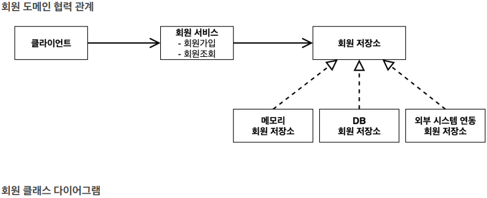
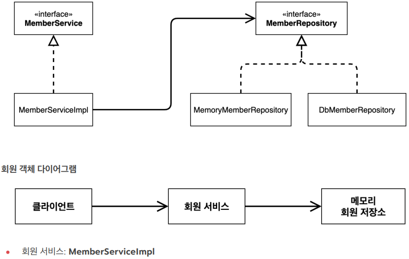
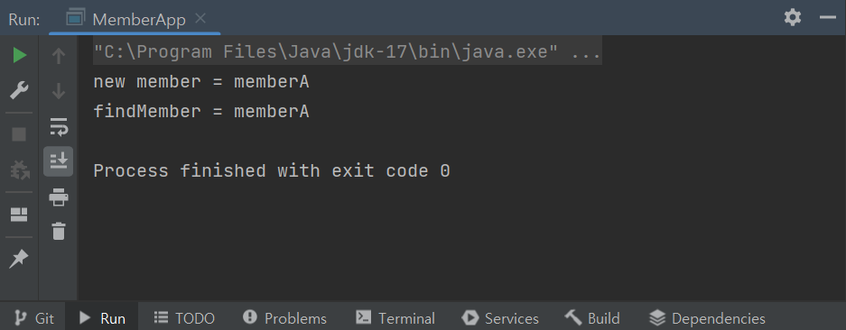
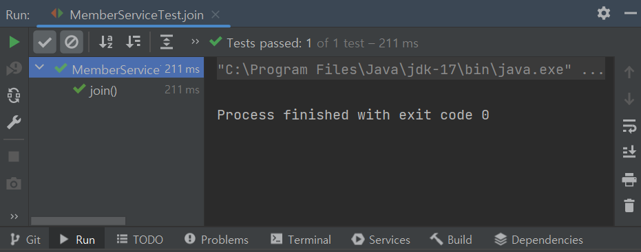
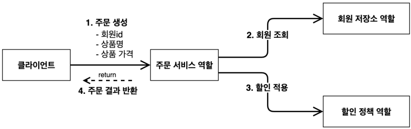
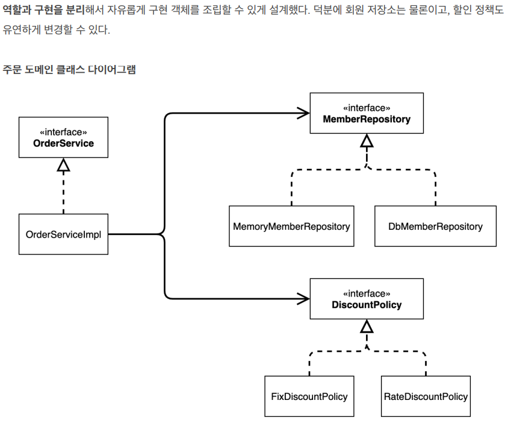
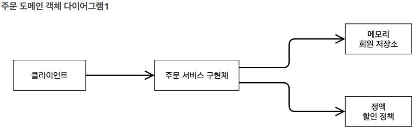
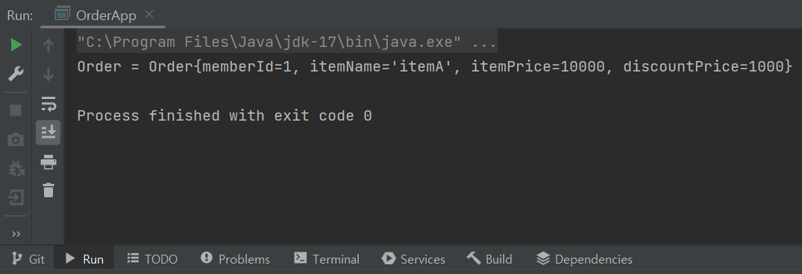

# 스프링 핵심 원리 - 기본편

### <2023-11-23>

<aside>
🚨 다음의 모든 내용들은 김영한님의 <b>“스프링 핵심 원리 - 기본편"</b> 강의를 토대로 작성한 것입니다.

</aside>

## Section2 - 스프링의 핵심 원리 이해1 - 예제 만들기

### 📍프로젝트 생성

스프링의 도움 없이 순수한 java 코드로 개발해보고 **다형성, OCP, DIP 등이 잘 지켜지는지 확인**하고 문제점이 발생한다면 객체 지향 원리를 적용하면서 해결해보자

1. https://start.spring.io ⇒ 스프링 부트 스타터 사이트로 이동해서 스프링 프로젝트 생성
2. 프로젝트 선택
    1. Project: Gradle - Groovy Project
       Spring Boot: 2.3.x
       Language: Java
       Packaging: Jar
       Java: 11
       Project Metadata
       groupId: hello
       artifactId: core
       Dependencies: 선택하지 않음
3. Gradle 대신에서 IntelliJ를 통해 실행하는 것이 실행속도가 더빠르므로 프로젝트 설정에서 변경해줌

---

### 📍비즈니스 요구사항과 설계

- 회원
    - 회원 가입과 조회 가능
    - 회원은 일반과 VIP 두 가지 등급이 있음
    - 회원 데이터는 자체 DB를 구축할 수 있고, 외부 시스템과 연결할 수 있음(미확정)
- 주문과 할인 정책
    - 회원은 상품을 주문할 수 있음
    - 회원 등급에 따라 할인 정책을 적용할 수 있음
    - 할인 정책은 모든 VIP는 1000원을 할인해주는 고정 금액 할인을 적용해달라. (나중에 변경 될 수 있음)
    - 할인 정책은 변경 가능성이 높음. 회사의 기본 할인 정책을 아직 정하지 못했고, 오픈 직전까지 고민을 미루
      고 싶음. 최악의 경우 할인을 적용하지 않을 수 도 있음 (미확정)

요구 사항에서 회원 데이터, 할인 정책 같은 부분은 지금 결정하기 어려운 부분이지만 개발을 무기한 기다릴 수도 없기 때문에 앞서 배운 객체 지향 설계 방법으로 **인터페이스를 만들고 구현체를 언제든지 갈아끼울 수 있도록 설계**해보려고함 !!

> 참고: 프로젝트 환경설정을 편리하게 하려고 스프링 부트를 사용한 것이고, 지금은 스프링 없는 순수한 자바로만
개발을 진행한다는 점을 꼭 기억하자! 스프링 관련은 한참 뒤에 등장함 !!!
>

---

### 📍회원 도메인 설계





### 📍회원 도메인 개발

- 회원 등급 enum 타입으로 생성

```java
package hello.core.member;

public enum Grade {
    BASIC,
    VIP
}
```

- 회원 엔티티

```java
package hello.core.member;

public class Member {
    private Long id;
    private String name;
    private Grade grade;

    public Member(Long id, String name, Grade grade) {
        this.id = id;
        this.name = name;
        this.grade = grade;
    }

    public Long getId() {
        return id;
    }

    public void setId(Long id) {
        this.id = id;
    }

    public String getName() {
        return name;
    }

    public void setName(String name) {
        this.name = name;
    }

    public Grade getGrade() {
        return grade;
    }

    public void setGrade(Grade grade) {
        this.grade = grade;
    }
}
```

- 회원 저장소 인터페이스

```java
package hello.core.member;

public interface MemberRepository {
    void save(Member member);

    Member findById(Long memberId);
}
```

- DB가 결정되지 않았지만 개발은 진행해야하기 때문에 가장 단순한 구현으로 member 패키지 안에 저장소와 서비스 클래스를 저장함
- 메모리 회원 저장소 구현체

```java
package hello.core.member;

import java.util.HashMap;
import java.util.Map;

public class MemoryMemberRepository implements MemberRepository{

    private static Map<Long, Member> store = new HashMap<>();
    @Override
    public void save(Member member) {
        store.put(member.getId(), member);
    }

    @Override
    public Member findById(Long memberId) {
        return store.get(memberId);
    }
}
```

> 참고 : HashMap은 동시성 이슈가 발생할 수 있어서 ConcurrentHashMap 사용을 권장함
>
- 회원 서비스 인터페이스

```java
package hello.core.member;

public interface MemberService {

    // 회원 가입
    void join(Member member);
    // 회원 조회
    Member findMember(Long memberId);
}
```

- 회원 서비스 구현체

```java
package hello.core.member;

public class MemberServiceImpl implements MemberService{

    private final MemberRepository memberRepository = new MemoryMemberRepository();

    @Override
    public void join(Member member) {
// 다형성에 의해서 인터페이스가 아닌 MemoryMemberRepository 클래스에 있는 save 메소드 호출
        memberRepository.save(member);
    }

    @Override
    public Member findMember(Long memberId) {
        return memberRepository.findById(memberId);
    }
}
```

### 📍회원 도메인 실행과 테스트

- 회원 가입 - main

```java
package hello.core;

import hello.core.member.Grade;
import hello.core.member.Member;
import hello.core.member.MemberService;
import hello.core.member.MemberServiceImpl;

public class MemberApp {
    public static void main(String[] args) {
        MemberService memberService = new MemberServiceImpl();
        Member member = new Member(1L, "memberA", Grade.VIP);
        memberService.join(member);

        Member findMember = memberService.findMember(1L);
        System.out.println("new member = " + member.getName());
        System.out.println("findMember = " + findMember.getName());

    }

}
```



위 코드(애플리케이션 로직)처럼 테스트 하는 것은 좋은 방법이 아니므로 Junit 테스트 프레임워크를 사용해보자

- 회원 가입 - test

```java
package hello.core.member;

import org.assertj.core.api.Assertions;
import org.junit.jupiter.api.Test;

public class MemberServiceTest {

    private MemberService memberService = new MemberServiceImpl();

    @Test
    void join(){
        // given
        Member member = new Member(1L, "memberA", Grade.VIP);
        // when
        memberService.join(member);
        Member findMember = memberService.findMember(1L);

        // then
        Assertions.assertThat(member).isEqualTo(findMember);

    }
}
```



- 다른 저장소로 변경할 때 OCP 원칙을 잘 준수할까요?
- DIP를 잘 지키고 있을까요?
    - private final MemberRepository memberRepository = new MemoryMemberRepository(); ⇒ 아니요 인터페이스와 구현체 모두를 의존하고 있어요
        - 주문 구현까지 만든 후 해결 방안 설명

### 📍주문과 할인 도메인 설계



1. 주문 생성 : 클라이언트는 주문 서비스에 주문 생성을 요청
2. 회원 조회 : 할인을 위해서는 회원 등급이 필요해서 주문 서비스는 회원 저장소에 회원을 조회
3. 할인 적용 : 주문 서비스는 회원 등급에 따른 할인 여부를 할인 정책에 위임
4. 주문 결과 반환 : 주문 서비스는 할인 결과를 포함한 주문 결과를 반환

> 참고 : 실제로는 주문 데이터를 DB에 저장하겠지만, 예제가 너무 복잡해질 수 있어서 생략하고 단순히 주문 결과를 반환
>




회원을 메모리에서 조회하고, 정액 할인 정책(고정 금액)을 지원해도 주문 서비스를 변경하지 않아도 됨, **역할들의 협력 관계를 그대로 재사용 할 수 있음**(= 메모리에서 DB로 바뀌거나 정액에서 정률 할인으로 바뀌어도 주문 서비스 구현체를 변경할 필요가 없음)

### 📍주문과 할인 도메인 개발

- 할인 정책 인터페이스

```java
package hello.core.discount;

import hello.core.member.Member;

public interface DiscountPolicy {

    /**
     *
     * @return 할인 대상 금액
     */
    int discount(Member member, int price);
}
```

- 정액 할인 정책 구현체
- 등급이 VIP일 때 할인되는 금액 1000원 반환

```java
package hello.core.discount;

import hello.core.member.Grade;
import hello.core.member.Member;

public class FixDiscountPolicy implements DiscountPolicy{

    private int discountFixAmount = 1000; // 1000원 할인
    @Override
    public int discount(Member member, int price) {
        if(member.getGrade() == Grade.VIP){
            return discountFixAmount;
        }
        else {
            return 0;
        }
    }
}
```

- 할인 책정이 된 후 불려지는 주문 엔티티

```java
package hello.core.order;

public class Order {
    private Long memberId;
    private String itemName;
    private int itemPrice;
    private int discountPrice;

    public Order(Long memberId, String itemName, int itemPrice, int discountPrice) {
        this.memberId = memberId;
        this.itemName = itemName;
        this.itemPrice = itemPrice;
        this.discountPrice = discountPrice;
    }
		public int calculaterPrice(){
        return itemPrice - discountPrice;
    }

    public Long getMemberId() {
        return memberId;
    }

    public void setMemberId(Long memberId) {
        this.memberId = memberId;
    }

    public String getItemName() {
        return itemName;
    }

    public void setItemName(String itemName) {
        this.itemName = itemName;
    }

    public int getItemPrice() {
        return itemPrice;
    }

    public void setItemPrice(int itemPrice) {
        this.itemPrice = itemPrice;
    }

    public int getDiscountPrice() {
        return discountPrice;
    }

    public void setDiscountPrice(int discountPrice) {
        this.discountPrice = discountPrice;
    }
// order 객체를 호출하면 출력되는 메소드
		@Override
    public String toString() {
        return "Order{" +
                "memberId=" + memberId +
                ", itemName='" + itemName + '\'' +
                ", itemPrice=" + itemPrice +
                ", discountPrice=" + discountPrice +
                '}';
    }
}
```

- 주문 서비스 인터페이스

```java
package hello.core.order;

public interface OrderService {
    Order createOrder(Long memberId, String itemName, int itemPrice);
}
```

<aside>
〰️ Member member = memberRepository.findById(memberId);<br>
주문 생성 요청이 오면 회원 정보 조회(등급을 위한 조회)<br>

</aside>

<aside>
〰️ int discountPrice = discountPolicy.discount(member, itemPrice);<br>
할인 정책에 회원 객체와 상품 가격을 넘김<br>

</aside>

<aside>
〰️ return new Order(memberId, itemName, itemPrice, discountPrice);<br>
최종 할인 금액(=discountPrice)와 함께 최종 생성된 주문을 반환<br>

</aside>

- 주문 서비스 구현체
- 메모리 회원 리포지토리와 고정 금액 할인 저책을 구현체로 생성함

```java
package hello.core.order;

import hello.core.discount.DiscountPolicy;
import hello.core.discount.FixDiscountPolicy;
import hello.core.member.Member;
import hello.core.member.MemberRepository;
import hello.core.member.MemoryMemberRepository;

public class OrderServiceImpl implements OrderService{

    private final MemberRepository memberRepository = new MemoryMemberRepository();
    private final DiscountPolicy discountPolicy = new FixDiscountPolicy();

    @Override
    public Order createOrder(Long memberId, String itemName, int itemPrice) {
        Member member = memberRepository.findById(memberId);
        int discountPrice = discountPolicy.discount(member, itemPrice);

        return new Order(memberId, itemName, itemPrice, discountPrice);
    }
}
```

- 주문 할인 정책 실행 - main

```java
package hello.core;

import hello.core.member.Grade;
import hello.core.member.Member;
import hello.core.member.MemberService;
import hello.core.member.MemberServiceImpl;
import hello.core.order.Order;
import hello.core.order.OrderService;
import hello.core.order.OrderServiceImpl;

public class OrderApp {
    public static void main(String[] args) {
        MemberService memberService = new MemberServiceImpl();
        OrderService orderService = new OrderServiceImpl();

        Long memberId = 1L;
        Member member = new Member(memberId, "memberA", Grade.VIP);
        memberService.join(member);

        Order order = orderService.createOrder(memberId, "itemA", 10000);

        System.out.println("Order = " + order);
    }
}
```



애플리케이션 로직으로 테스트 하는 것 대신 JUnit 테스트를 사용해보자

- 주문과 할인 정책 - test

```java
package hello.core.order;

import hello.core.member.Grade;
import hello.core.member.Member;
import hello.core.member.MemberService;
import hello.core.member.MemberServiceImpl;
import org.assertj.core.api.Assertions;
import org.junit.jupiter.api.Test;

public class OrderServiceTest {

    MemberService memberService = new MemberServiceImpl();
    OrderService orderService = new OrderServiceImpl();

    @Test
    void createOrder(){
        Long memberId = 1L;
        Member member = new Member(memberId, "memberA", Grade.VIP);
        memberService.join(member);

        Order order = orderService.createOrder(memberId, "itemA", 10000);
        Assertions.assertThat(order.getDiscountPrice()).isEqualTo(1000);

    }
}
```


> 스프링 입문 강의에서 회원 서비스를 위와 같이 인터페이스와 구현체로 생성해봐서 생각보다 이해가 잘 되었다. 추가로  주문과 할인 역할을 나누어서 구현해보니 어떤 방식으로 코드가 흘러가는지 더 눈에 보인다. 다음 강의에서는 정률 할인 정책 구현체를 생성했을 때 클라이언트에게 영향을 주지 않고 객체 지향적으로 개발되었는지 확인할 것이다.
>