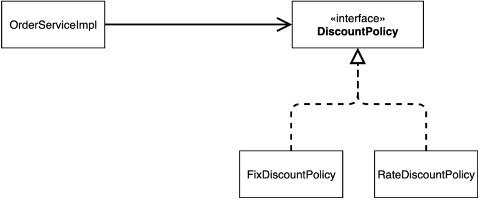
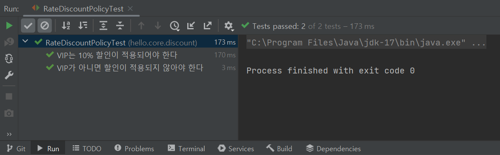
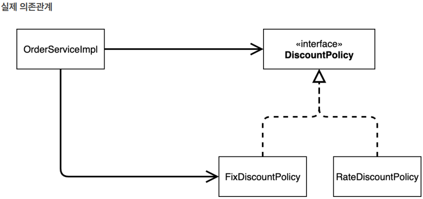
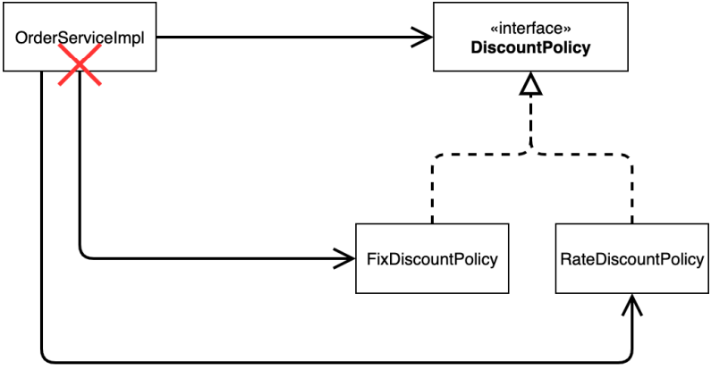

# 스프링 핵심 원리 - 기본편

### <2023-12-01>

<aside>
🚨 다음의 모든 내용들은 김영한님의 <b>“스프링 핵심 원리 - 기본편”</b> 강의를 토대로 작성한 것입니다.
</aside>

## Section3 - 스프링 핵심 원리 이해 2 - 객체 지향 원리 적용

### 📍새로운 할인 정책 개발

**새로운 할인 정책을 확장해보자**

<aside>
✔️ 악덕 기획자 :

- 서비스 오픈 직전에 할인 정책을 지금처럼 고정 금액 할인이 아니라 좀 더 합리적인 주문 금액당 할
  인하는 **정률% 할인으로 변경**하고 싶어요. 예를 들어서 기존 정책은 VIP가 10000원을 주문하든 20000원을 주
  문하든 항상 1000원을 할인했는데, 이번에 새로 나온 정책은 10%로 지정해두면 고객이 10000원 주문시 1000
  원을 할인해주고, 20000원 주문시에 2000원을 할인해주는 거에요!

순진 개발자 :

- 제가 처음부터 고정 금액 할인은 아니라고 했잖아요.

악덕 기획자 :

- 애자일 소프트웨어 개발 선언 몰라요? “계획을 따르기보다 변화에 대응하기를”

순진 개발자 :

- … (하지만 난 **유연한 설계가 가능하도록 객체지향 설계 원칙을 준수**했지 후후)
</aside>

순진 개발자가 정말 객체지향 설계 원칙을 잘 준수 했는지 확인해 보기 위해 이번에는 주문한 금액의 %를 할인해주는 새로운
정률 할인 정책을 추가해보자

- RateDiscountPolicy 추가



```java
package hello.core.discount;

import hello.core.member.Grade;
import hello.core.member.Member;

class RateDiscountPolicy implements DiscountPolicy{

    private int discountPercent =10;
    @Override
    public int discount(Member member, int price) {
        if(member.getGrade() == Grade.VIP){
            return price * discountPercent / 100;
        }
        else{
            return 0;
        }
    }
}
```

- RateDiscountPolicyTest.java

```java
package hello.core.discount;

import hello.core.member.Grade;
import hello.core.member.Member;
import org.assertj.core.api.Assertions;
import org.junit.jupiter.api.DisplayName;
import org.junit.jupiter.api.Test;

import static org.junit.jupiter.api.Assertions.*;

class RateDiscountPolicyTest {

    RateDiscountPolicy discountPolicy = new RateDiscountPolicy();

    @Test
    // 한글 입력 가능
    @DisplayName("VIP는 10% 할인이 적용되어야 한다")
    void vip_o(){
        // given
        Member member = new Member(1L, "memberVIP", Grade.VIP);
        // when
        int discount = discountPolicy.discount(member, 10000);
        // then
        Assertions.assertThat(discount).isEqualTo(1000);
    }

}
```

- 성공 테스트도 중요하지만 실패 테스트도 만들어서 실행해봐야함

<aside>
〰️ import static org.assertj.core.api.Assertions.*; // Assertions 생략 시 추가

@Test<br>
// 한글 입력 가능<br>
@DisplayName("VIP가 아니면 할인이 적용되지 않아야 한다")<br>
void vip_x(){    
//given    
Member member = new Member(2L, "memberBASIC", Grade.*BASIC*);    
//when    
int discount = discountPolicy.discount(member, 10000);    
//then    
*assertThat*(discount).isEqualTo(0);
}

</aside>



실전 코드에서 [RateDiscountPolicy.java](http://RateDiscountPolicy.java) 적용해보자

### 📍새로운 할인 정책 적용과 문제점

할인 정책을 변경하려면 클라이언트인 OrderServiceImpl 코드를 수정해야 함

<aside>
〰️ public class OrderServiceImpl implements OrderService{<br>
// private final DiscountPolicy discountPolicy = new FixDiscountPolicy();<br>
<b>private final DiscountPolicy discountPolicy = new RateDiscountPolicy();</b><br>
}<br>

</aside>

🚨 **********************문제점 발견**********************

- 우리는 역할과 구현을 충실하게 분리함? → OK
- 다향성도 활용하고, 인터페이스와 구현 객체를 분리함? → OK
- OCP, DIP 같은 객체 지향 설계 원칙을 충실히 준수함?
    - → 그렇게 보이지만 사실은 아님
- DIP : 주문 서비스 클라이언트(OrderServiceImpl) DiscountPolicy 인터페이스에 의존하면서 DIP를 지킨 것 같은데?
    - 클래스 이존 관계를 분석해 보면, 추상(인터페이스) 뿐만 아니라 구체(구현) 클래스에도 의존하고 있음
        - 추상(인터페이스) 의존 : DiscountPolicy
        - 구체(구현) 클래스 : FixDiscountPolicy, RateDiscountPolicy

  

  > 클라이언트인 OrderServiceImpl이 DiscountPolicy 인터페이스 뿐만 아니라 FixDiscountPolicy인 구체 클래스도 함께 의존하고 있고 실제 코드에서도 의존하고 있음 ⇒ **DIP 위반 !!**

- OCP : 변경하지 않고 확장할 수 있다고 했는데 !!
    - ⇒ 지금 코드는 기능을 확장해서 변경하면, 클라이언트 코드에 영향을 주기 때문에 **OCP 위반 !!**

  

  > 그래서 !!! FixDiscountPolicy를 RateDiscountPolicy로 변경하는 순간 OrderServiceImpl의 소스코드도 함께 변경해야 함 ⇒ **OCP 위반**


**************************************************어떻게 문제를 해결할 수 있을까?**************************************************

⇒ 인터페이스(추상)에만 의존하도록 설계를 변경해야함

- 클라이언트(OrderServiceImpl)가 인터페이스에만 의존하도록 변경

<aside>
〰️ public class OrderServiceImpl implements OrderService {<br>
//private final DiscountPolicy discountPolicy = new RateDiscountPolicy();<br>
<b>private DiscountPolicy discountPolicy;</b><br>
}<br>

</aside>

그런데 구현체가 없는데 어떻게 코드를 실행할 수 있을까?

✔️문제를 해결하려면 누군가가 클라이언트인 OrderServiceImpl 에 DiscountPolicy 의 구현 객체를 대신 생성하고 주입해주어야 함