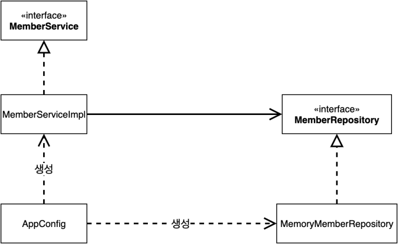
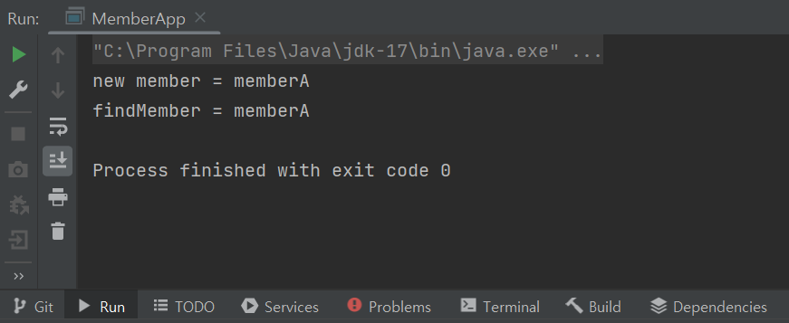
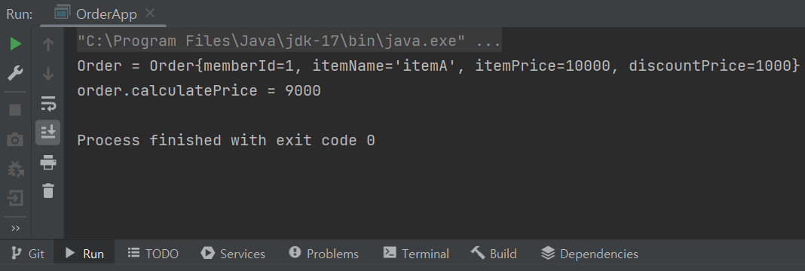

# 스프링 핵심 원리 - 기본편
### <2023-12-08>

<aside>
🚨 다음의 모든 내용들은 김영한님의 <b>“스프링 핵심 원리 - 기본편”</b>> 강의를 토대로 작성한 것입니다.

</aside>

## Section3 - 스프링 핵심 원리 이해 2 - 객체 지향 원리 적용

### 📍관심사의 분리

- [MemberServiceImpl.java](http://MemberServiceImpl.java) 생성자 주입

```java
package hello.core.member;

public class MemberServiceImpl implements MemberService{

    private final MemberRepository memberRepository;

    // MemberRepository(인터페이스)에만 의존 => DIP
    public MemberServiceImpl(MemberRepository memberRepository) {
        this.memberRepository = memberRepository;
    }

    @Override
    public void join(Member member) {
        memberRepository.save(member);
    }

    @Override
    public Member findMember(Long memberId) {
        return memberRepository.findById(memberId);
    }
}
```

- 생성자 주입 설계를 통해서 MemberServiceImpl은 MemoryMemberRepository를 의존하지 않고, **단지 MemberRepository 인터페이스만 의존함** !!
- 이제 MemberServiceImpl 입장에서 어떤 구현 객체가 들어올지(주입될지)는 알 수 없고,  구현 객체 주입은 오직 외부(AppConfig)에서 결정됨
    - **‘의존 관계에 대한 고민은 외부’에 맡기고 ‘실행’만 집중하면 됨**

클래스 다이어그램



- MemberService 구현하는 MemberServiceImpl은 MemberRepository 추상에만 의존하고 구체 클래스는 모름**(=DIP 완성)** ⇒ 객체의 생성과 연결은 AppConfig가 담당함
- **관심사의 분리** : 객체를 생성하고 연결하는 역할과 실행하는 역할이 명확히 분리됨

- OrderServiceImpl[.java](http://MemberServiceImpl.java) 생성자 주입

```java
package hello.core.order;

import hello.core.discount.DiscountPolicy;
import hello.core.discount.FixDiscountPolicy;
import hello.core.discount.RateDiscountPolicy;
import hello.core.member.Member;
import hello.core.member.MemberRepository;
import hello.core.member.MemoryMemberRepository;

public class OrderServiceImpl implements OrderService{

    // 인터페이스에만 의존 => DIP
    private final MemberRepository memberRepository;
    private final DiscountPolicy discountPolicy;

    // 구현체와 분리되어서 어떤 구현체가 주입될지 모름
    public OrderServiceImpl(MemberRepository memberRepository, DiscountPolicy discountPolicy) {
        this.memberRepository = memberRepository;
        this.discountPolicy = discountPolicy;
    }

    @Override
    public Order createOrder(Long memberId, String itemName, int itemPrice) {
        Member member = memberRepository.findById(memberId);
        int discountPrice = discountPolicy.discount(member, itemPrice);

        return new Order(memberId, itemName, itemPrice, discountPrice);
    }
}
```

- 생성자 주입 설계를 통해서 OrderServiceImpl은 FixDiscountPolicy를 의존하지 않고, **단지 DiscountPolicy 인터페이스만 의존함 !!!**
- 이제 MemberServiceImpl 입장에서 어떤 구현 객체가 들어올지(주입될지) 알 수 없고, 구현 객체 주입(MemoryMemberRepository, FixDiscountPolicy)은 오직 외부(AppConfig)에서 결정됨 ⇒ OrderServiceImpl은 실행에만 집중하면 됨!

**AppConfig 실행**

<aside>
〰️ public class MemberApp {

public static void main(String[] args) {

AppConfig appConfig = new AppConfig();

MemberService memberService = appConfig.memberService();

//   MemberService memberService = new MemberServiceImpl();
Appconfig를 통한 실행

</aside>

- MemberApp.java

```java
package hello.core;

import hello.core.member.*;

public class MemberApp {
    public static void main(String[] args) {
        AppConfig appConfig = new AppConfig();
        MemberService memberService = appConfig.memberService();
//        MemberService memberService = new MemberServiceImpl();
        Member member = new Member(1L, "memberA", Grade.VIP);
        memberService.join(member);

        Member findMember = memberService.findMember(1L);
        System.out.println("new member = " + member.getName());
        System.out.println("findMember = " + findMember.getName());

    }

}
```



<aside>
〰️ public class OrderApp {

public static void main(String[] args) {

AppConfig appConfig = new AppConfig();        
MemberService memberService = appConfig.memberService();
OrderService orderService = appConfig.orderService();

//        MemberService memberService = new MemberServiceImpl();

//        OrderService orderService = new OrderServiceImpl();
AppConfig에서 객체를 생성하고 생성자에 객체 주입 !!

</aside>

- OrderApp.java

```java
package hello.core;

import hello.core.member.Grade;
import hello.core.member.Member;
import hello.core.member.MemberService;
import hello.core.order.Order;
import hello.core.order.OrderService;

public class OrderApp {
    public static void main(String[] args) {
        AppConfig appConfig = new AppConfig();
        MemberService memberService = appConfig.memberService();
        OrderService orderService = appConfig.orderService();

        Long memberId = 1L;
        Member member = new Member(memberId, "memberA", Grade.VIP);
        memberService.join(member);

        Order order = orderService.createOrder(memberId, "itemA", 10000);

        System.out.println("Order = " + order);
        System.out.println("order.calculatePrice = " + order.calculatePrice());
    }
}
```



- 테스트 코드 오류 수정
- 테스트를 실행하기 전에 @BeforeEach 호출

```java
```java
public class MemberServiceTest {

    MemberService memberService;

    @BeforeEach
    public void beforeEach(){
        AppConfig appConfig = new AppConfig();
        memberService = appConfig.memberService();
    }
}
```

```java
```java
public class OrderServiceTest {

    MemberService memberService;
    OrderService orderService;

    @BeforeEach
    public void befoerEach(){
        AppConfig appConfig = new AppConfig();
        memberService = appConfig.memberService();
        orderService = appConfig.orderService();
    }
}
```

<aside>
✨ AppConfig를 통해서 관심사를 확실하게 분리함

</aside>