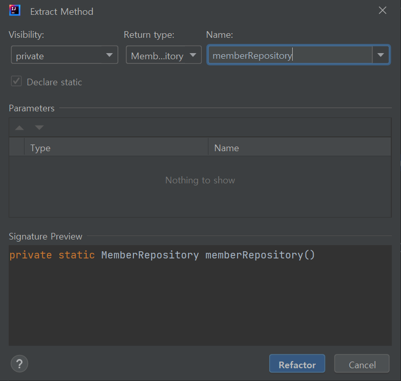

# 스프링 핵심 원리 - 기본편

### <2023-12-14>

<aside>
🚨 다음의 모든 내용들은 김영한님의 <b>“스프링 핵심 원리 - 기본편”</b> 강의를 토대로 작성한 것입니다.

</aside>

## Section3 - 스프링 핵심 원리 이해 2 - 객체 지향 원리 적용

### 📍AppConfig 리팩터링

역할과 구현이 구분되어서 잘 보여야 하지만 현재 AppConfig는 그렇지 않고 중복도 있음(⇒new MemoryMemberRepository)

<aside>
💡 Alt + Shift + M ⇒ new 메소드() 부분을 드래그 후 Extract Method(메소드 추출)

</aside>



- Appconfig 리팩토링
    - new MemoryMemberRepository() 중복 부분을 제거하고 MemoryMemberRepository를 다른 구현체로 변경할 때 한 부분만 변경하면 됨
    - MemberService, MemberRepository, OrderService역할과 구현 객체의 메소드 명으로 역할과 구현이 잘 드러나게 리택토링함
    - 후에 DB 변경 시 구현 객체 생성을 리턴하는 부분만 변경하면 됨

```java
package hello.core;

import hello.core.discount.DiscountPolicy;
import hello.core.discount.FixDiscountPolicy;
import hello.core.member.MemberRepository;
import hello.core.member.MemberService;
import hello.core.member.MemberServiceImpl;
import hello.core.member.MemoryMemberRepository;
import hello.core.order.OrderService;
import hello.core.order.OrderServiceImpl;

public class AppConfig {

    public MemberService memberService(){
        return new MemberServiceImpl(memberRepository());
    }

    private static MemberRepository memberRepository() {
        return new MemoryMemberRepository();
    }

    public OrderService orderService(){
        return new OrderServiceImpl(memberRepository(), discountPolicy());
    }

    public DiscountPolicy discountPolicy(){
        return new FixDiscountPolicy();
    }
}
```

### 📍새로운 구조와 할인 정책 적용

처음으로 돌아가서 정액(FixDiscountPolicy) → 정률(RateDiscountPolicy)% 할인 정책으로 변경

**어떤 부분을 변경 ? ⇒ AppConfig**

***AppConfig의 등장으로 애플리케이션이 크게 사용 영역과, 객체를 생성하고 구성하는 영역으로 분리되었음.***

***즉, 사용 영역은 영향을 받지 않고, 구성 영역의 코드만 수정하면 된다 !!***


클라이언트 코드인 OrderServiceImpl를 포함해서 사용 영역의 어떤 코드도 변경할 필요가 없음

AppConfig를 애플리케이션이라는 공연의 기획자로 생각하고 공연 기획자는 공연 참여자인 구현 객체들을 모두 알아야 함

- 할인 정책 변경으로 구성한 코드

<aside>
〰️ public class AppConfig {

    public DiscountPolicy discountPolicy(){

//        return new FixDiscountPolicy();

return new RateDiscountPolicy();

}

}

FixDiscountPolicy → RateDiscountPolicy 객체로 변경

</aside>